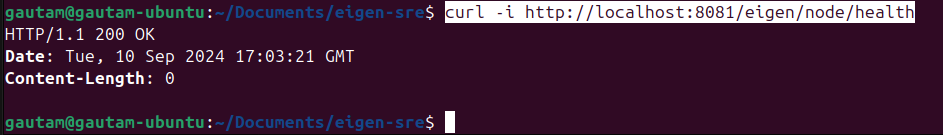

# Task 5- EigenLayer Brevis Co-chain AVS Setup

## Install Eigenlayer CLI

- Install Docker and Docker Compose
- Install CLI using Binary
- Import Keys

## Set up the Holesky Operator

- Add ETH to ECDSA Wallet
- Operator Configuration and Registration

## Set up Brevis Binary

- Install Brevis Binary

## Run Brevis Binary as Systemd service

- Create a new systemd service file
- Add the necessary script to brevis.service file
- Reload the systemd manager configuration and enable the service to start on boot

## Start and perform health check of the service

- Start the service
- Check the status of the service

## Set up Prometheus, Node Exporter and Mimir using Docker Compose

- Create a docker compose file with required configs
- Create `mimir-config.yaml` and `prometheus.yml`
- Run `docker compose up -d`
- Add Prometheus as data source and point it to Mimir URL
- Open `localhost:9009` to open grafana UI

## Deliverables

- A holesky registered operator address with your registration number as the operator name

    ```sh
    eigenlayer operator status operator.yaml
    ```

- The systemd file that you used to run the brevis binary

  ```sh
  sudo systemctl status brevis
  ```

- Logs of the systemd service running
  
  ```sh
  journalctl -u brevis -f
  ```

- A screenshot of the response from a curl request to the health check endpoint
  
  ```sh
  curl -i http://localhost:8081/eigen/node/health
  ```

  
